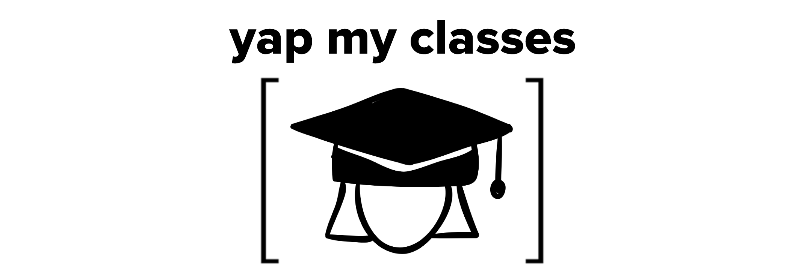

<div align = center>

</div>

# `yap my classes`
`yap my classes` (YMC) is a self-hosted Matrix server for anonymously communicating with other students in your University at Buffalo (UB) classes.

It works by prompting the user for a UB Navigate access token (username field), which allows YMC to assign the user to text channels corresponding to their specific class sections. Users may also provide a password (password field) so that they may log in under the same account at a later date. Even if the access token refreshes, the user can still log in with their new token and the same password.

## Features
* **Matrix!** - Built on the matrix protocol for a feature-rich interface.
* **Client Agnostic** - Can use dozens of different frontends on any device, any platform.
* **Anonymous** - Communicate with fellow students without revealing your identity.

## Goals
* Provide a centralized(?) hub for students to communicate with classmates efficiently and effectively.
* Talk to students in your courses, your MWF lecture, your 3 PM recitation, or your 7 PM lab on Friday—there's a group chat for them all!
* Meet new people (DM them!), find study buddies, stay on top of due dates, and prepare for impending ~~doom~~ tests.
* Encourage open and honest conversations with anonymity.

## Installation
## Nix Flake
```nix
# flake.nix

{
  inputs.yap-my-classes.url = "github:ok-nick/ubh-fall2022-repotemplate-ok-nick";
  # ...

  outputs = {nixpkgs, ...} @ inputs: {
    nixosConfigurations.HOSTNAME = nixpkgs.lib.nixosSystem {
      specialArgs = { inherit inputs; }; # this is the important part
      modules = [
        ./configuration.nix
      ];
    };
  } 
}

# configuration.nix

{inputs, pkgs, ...}: {
   programs.yap-my-classes = {
    enable = true;
    package = inputs.yap-my-classes.packages.${pkgs.system}.default;
  };
}
```
## Other
Install `matrix-synapse`, `postgresql`, `nginx`, etc. TODO

## UB Hacking Fall 2023 Rules 
- Teams can consist of between 1 and 4 people.
- To have your submission be considered for judging, you must submit a 2-5 minute video along with your project. Try to keep it as concise as possible!
- The projects submitted for judging cannot have been started prior to the start of the hackathon. In other words, teams can plan their projects in great detail, but they cannot begin writing code until they arrive at the hackathon.
- Additionally, we are partnering with MLH this year, which means that our hackers must follow their code of conduct which can be found below.
- Any and all resources used must be open source and specified in either the project, or the project description.
- Your project must be publically available and under source control in this repository.
- Prior to submitting to devpost, your project must be fully committed and pushed to this repository.
- The link to this repository must be available on your devpost submission.
- Projects can not have been submitted to another event, including other hackathons this weekend.
- [Code of Conduct](https://drive.google.com/file/d/1RH_TtRu6EOHSbOoiSj2h1Q4jswtVILzE/view)
- [MLH Code of Conduct](https://static.mlh.io/docs/mlh-code-of-conduct.pdf)

